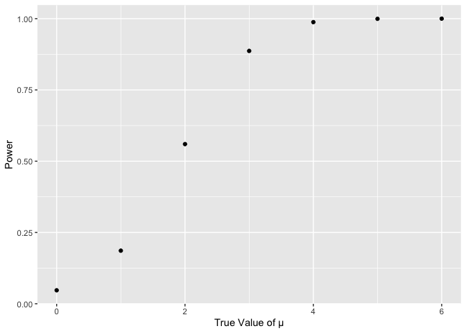
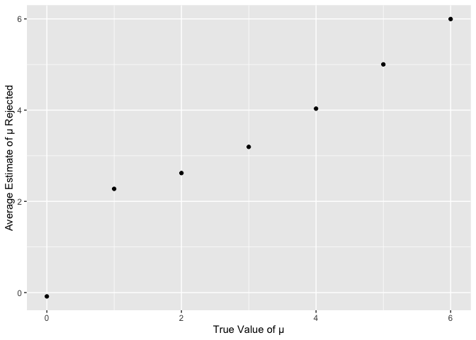

Homework 5
================
2023-11-14

## Problem 1

Read csv homicide data:

``` r
homicide = read_csv("data/p1/homicide-data.csv", show_col_types = FALSE)
```

Create a city_state variable (e.g. “Baltimore, MD”) and then summarize
within cities to obtain the total number of homicides and the number of
unsolved homicides (those for which the disposition is “Closed without
arrest” or “Open/No arrest”).

``` r
homicides_by_city_state = 
  homicide |>
  mutate(city_state = paste(city, state, sep = ", ")) 
```

``` r
homicides_summarize_within_cities = homicides_by_city_state |>
  group_by(city_state)  |>
  mutate(unsolved = disposition %in% c("Closed without arrest","Open/No arrest")) |>
  summarise(total_homicides = n(), unsolved_homicides = sum(unsolved)) 
```

``` r
homicides_summarize_within_cities
```

    ## # A tibble: 51 × 3
    ##    city_state      total_homicides unsolved_homicides
    ##    <chr>                     <int>              <int>
    ##  1 Albuquerque, NM             378                146
    ##  2 Atlanta, GA                 973                373
    ##  3 Baltimore, MD              2827               1825
    ##  4 Baton Rouge, LA             424                196
    ##  5 Birmingham, AL              800                347
    ##  6 Boston, MA                  614                310
    ##  7 Buffalo, NY                 521                319
    ##  8 Charlotte, NC               687                206
    ##  9 Chicago, IL                5535               4073
    ## 10 Cincinnati, OH              694                309
    ## # ℹ 41 more rows

For the city of Baltimore, MD, use the prop.test function to estimate
the proportion of homicides that are unsolved; save the output of
prop.test as an R object, apply the broom::tidy to this object and pull
the estimated proportion and confidence intervals from the resulting
tidy dataframe.

``` r
baltimore = 
  homicides_summarize_within_cities |> 
  filter(city_state == "Baltimore, MD")
baltimore_test = 
  prop.test(x = baltimore$"unsolved_homicides",n = baltimore$"total_homicides")
baltimore_result = 
  broom::tidy(baltimore_test) |> 
  select(estimate, conf.low, conf.high)
```

``` r
baltimore_result
```

    ## # A tibble: 1 × 3
    ##   estimate conf.low conf.high
    ##      <dbl>    <dbl>     <dbl>
    ## 1    0.646    0.628     0.663

Now run prop.test for each of the cities in your dataset, and extract
both the proportion of unsolved homicides and the confidence interval
for each. Do this within a “tidy” pipeline, making use of purrr::map,
purrr::map2, list columns and unnest as necessary to create a tidy
dataframe with estimated proportions and CIs for each city.

``` r
cities_result = homicides_summarize_within_cities |>
  mutate(
    prop_tests = 
      map2(unsolved_homicides, total_homicides,~prop.test(x = .x, n = .y)), tests_tidy = map(prop_tests, broom::tidy)
    ) |>
  unnest(tests_tidy) |>
  select(city_state, estimate, conf.low, conf.high)
```

    ## Warning: There was 1 warning in `mutate()`.
    ## ℹ In argument: `prop_tests = map2(...)`.
    ## Caused by warning in `prop.test()`:
    ## ! Chi-squared approximation may be incorrect

``` r
cities_result
```

    ## # A tibble: 51 × 4
    ##    city_state      estimate conf.low conf.high
    ##    <chr>              <dbl>    <dbl>     <dbl>
    ##  1 Albuquerque, NM    0.386    0.337     0.438
    ##  2 Atlanta, GA        0.383    0.353     0.415
    ##  3 Baltimore, MD      0.646    0.628     0.663
    ##  4 Baton Rouge, LA    0.462    0.414     0.511
    ##  5 Birmingham, AL     0.434    0.399     0.469
    ##  6 Boston, MA         0.505    0.465     0.545
    ##  7 Buffalo, NY        0.612    0.569     0.654
    ##  8 Charlotte, NC      0.300    0.266     0.336
    ##  9 Chicago, IL        0.736    0.724     0.747
    ## 10 Cincinnati, OH     0.445    0.408     0.483
    ## # ℹ 41 more rows

Create a plot that shows the estimates and CIs for each city – check out
geom_errorbar for a way to add error bars based on the upper and lower
limits. Organize cities according to the proportion of unsolved
homicides

``` r
ggplot(cities_result, aes(x = city_state, y = estimate)) +
  geom_point() +
  geom_errorbar(aes(ymin = conf.low, ymax = conf.high)) +
  coord_flip() 
```

<!-- -->

## Problem 2

Create a tidy dataframe containing data from all participants, including
the subject ID, arm, and observations over time:

Start with a dataframe containing all file names; the list.files
function will help Iterate over file names and read in data for each
subject using purrr::map and saving the result as a new variable in the
dataframe Tidy the result; manipulate file names to include control arm
and subject ID, make sure weekly observations are “tidy”, and do any
other tidying that’s necessary

``` r
files_list = list.files(path = "data/p2", full.names = TRUE)
files_dataframe = tibble(file_name = files_list) |>
  mutate(data = purrr::map(file_name, ~ read_csv(.x, show_col_types = FALSE))) |>    
  mutate(file = substr(file_name, nchar(file_name)-10+1, nchar(file_name))) |> 
  mutate(file = str_replace(file, "\\..*", "")) |>
  separate(file, c("arm", "id"), sep = "_") |>   
  select(id, arm, data) |> 
  unnest(data) |>               
  pivot_longer(cols = week_1:week_8, names_prefix = "week_", names_to = "week", values_to = "data")
```

``` r
files_dataframe
```

    ## # A tibble: 160 × 4
    ##    id    arm   week   data
    ##    <chr> <chr> <chr> <dbl>
    ##  1 01    con   1      0.2 
    ##  2 01    con   2     -1.31
    ##  3 01    con   3      0.66
    ##  4 01    con   4      1.96
    ##  5 01    con   5      0.23
    ##  6 01    con   6      1.09
    ##  7 01    con   7      0.05
    ##  8 01    con   8      1.94
    ##  9 02    con   1      1.13
    ## 10 02    con   2     -0.88
    ## # ℹ 150 more rows

Make a spaghetti plot showing observations on each subject over time,
and comment on differences between groups.

``` r
ggplot(files_dataframe, aes(x = week , y = data, group = id, color = arm)) + 
  geom_point() + 
  labs(x = "Week", y = "Data") 
```

<!-- -->
The experimental group generally exhibits higher values than the control
group, and these values tend to increase over time in the experimental
group.

## Problem 3

For each dataset, save μ and the p-value arising from a test of H:μ=0
using α=0.05 Repeat the above for μ={1,2,3,4,5,6}, and complete the
following:

``` r
each_sim = function(mu, n=30, sigma=5) {
  sample = rnorm(n, mu, sigma) 
  sample_t = t.test(sample) 
  sample_t |> 
    broom::tidy() |> 
    select(c("estimate", "p.value"))
}

results =
  expand_grid(true_mu = 0:6, nsims = 1:5000) |>
  mutate(temp = map(true_mu, each_sim)) |>
  unnest(temp) |>
  group_by(true_mu) |>
  mutate(rej_null = p.value < 0.05) |>
  summarise(power = mean(rej_null), avg = mean(estimate),avg_rej = mean(estimate[rej_null])) 
```

``` r
results
```

    ## # A tibble: 7 × 4
    ##   true_mu  power      avg avg_rej
    ##     <int>  <dbl>    <dbl>   <dbl>
    ## 1       0 0.0472 -0.00928 -0.0832
    ## 2       1 0.186   1.01     2.27  
    ## 3       2 0.56    2.00     2.62  
    ## 4       3 0.887   3.00     3.19  
    ## 5       4 0.988   4.00     4.03  
    ## 6       5 0.999   5.00     5.00  
    ## 7       6 1       6.00     6.00

Make a plot showing the proportion of times the null was rejected (the
power of the test) on the y axis and the true value of μ on the x axis.
Describe the association between effect size and power.

``` r
results |>
  ggplot(aes(x = true_mu, y = power)) +
  geom_point() +
  labs(x = "True Value of µ", y = "Power")
```

<!-- -->

The power increases as the true value of µ rises. When the true value of
µ surpasses 4, the power remains at 1, when true value of µ is small,
the power is also very low.

Make a plot showing the average estimate of μ on the y axis and the true
value of μ on the x axis. Make a second plot (or overlay on the first)
the average estimate of μ only in samples for which the null was
rejected on the y axis and the true value of μ on the x axis. Is the
sample average of μ across tests for which the null is rejected
approximately equal to the true value of μ? Why or why not?

``` r
results |>
  ggplot(aes(x = true_mu, y = avg)) +
  geom_point() +
  labs(x = "True Value of µ", y = "Average Estimate of µ")
```

<!-- -->
The average estimate of µ is very close to the true value of µ.

``` r
results |>
  ggplot(aes(x = true_mu, y = avg_rej)) +
  geom_point() +
  labs(x = "True Value of µ", y = "Average Estimate of µ Rejected")
```

<!-- -->
When the true value of µ is 0,the sample average of μ across tests for
which the null is rejected approximately not equal to the true value of
μ, but when the true value of µ greater than 1, the sample average of μ
across tests for which the null is rejected approximately equal to the
true value of μ.
